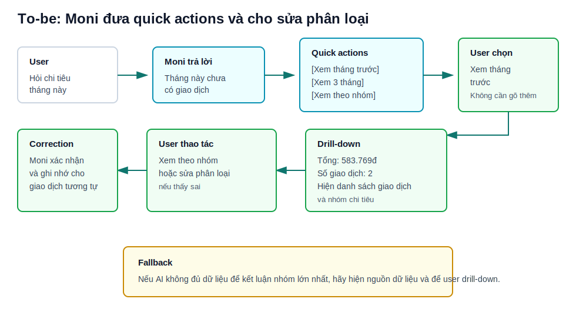

# Workshop Cá Nhân - MoMo Moni App Teardown

## App được chọn

**MoMo - Moni**

**AI feature:** Trợ thủ tài chính trong app MoMo, hỗ trợ phân tích chi tiêu, gợi ý tài chính cá nhân và chatbot hỏi đáp về dòng tiền/chi tiêu.

## 1. Dùng thử: Promise vs Reality

### Promise

Moni hứa giúp user hiểu tình hình tài chính cá nhân, phân tích chi tiêu, nhận diện khoản chi và hỗ trợ quản lý tiền tốt hơn.

### User được hứa sẽ được giúp

Người dùng MoMo có nhiều giao dịch hằng ngày, muốn biết mình tiêu tiền vào đâu, khoản nào bất thường, và nên kiểm soát chi tiêu như thế nào.

### Query đã test trong screenshot

```text
tháng này tôi tiêu nhiều tiền nhất vào khoản nào?
```

```text
tháng trước
```

```text
chi tiêu linh tinh của tôi là gì?
```

### Kỳ vọng

Moni hiểu được intent tài chính cá nhân, phân loại giao dịch rõ ràng, chỉ ra nhóm chi tiêu chính, giải thích vì sao một khoản bị xếp vào nhóm nào, và gợi ý hành động tiếp theo.

## 2. Evidence từ screenshot

### Observation 1: Moni trả lời đúng khi tháng này chưa có chi tiêu

Khi user hỏi:

```text
tháng này tôi tiêu nhiều tiền nhất vào khoản nào?
```

Moni trả lời:

```text
Tháng này (từ 2026-06-01 đến 2026-06-03), bạn chưa tiêu tiền vào bất kỳ khoản nào.
Ví tiền vẫn nguyên vẹn, không có giao dịch nào được ghi nhận.
```

Nhận xét: câu trả lời đúng với dữ liệu hiện tại, nhưng chưa có gợi ý nhanh để xem tháng trước hoặc xem lịch sử chi tiêu.

### Observation 2: Moni giữ được ngữ cảnh "tháng trước"

Khi user hỏi tiếp:

```text
tháng trước
```

Moni trả lời:

```text
Tháng trước (2026-05-01 đến 2026-05-31), tổng chi tiêu của bạn là 583.769đ với 2 giao dịch.
Tuy nhiên, mình chưa thấy thông tin chi tiết về khoản nào chiếm nhiều nhất.
```

Sau đó Moni hỏi lại:

```text
Bạn muốn xem chi tiết từng khoản chi tiêu theo từng nhóm không?
Nếu có, mình sẽ liệt kê cụ thể cho bạn ngay!
```

Nhận xét: Moni giữ context tốt, hiểu "tháng trước" là tiếp nối câu hỏi trước. Điểm yếu là Moni biết có **2 giao dịch** nhưng chưa hiển thị ngay danh sách/nhóm chi tiêu/CTA để user drill-down.

### Observation 3: Moni hiểu "chi tiêu linh tinh" là "Chi phí phát sinh"

Khi user hỏi:

```text
chi tiêu linh tinh của tôi là gì?
```

Moni trả lời:

```text
Từ ngày 2026-06-01 đến 2026-06-03, bạn chưa có khoản chi tiêu nào thuộc nhóm Chi phí phát sinh
(hay còn gọi là "chi tiêu linh tinh"). Ví của bạn vẫn sạch bóng, không có giao dịch linh tinh nào hết!
```

Sau đó Moni hỏi tiếp:

```text
Bạn muốn xem lại chi tiêu linh tinh của tháng trước hay cần báo cáo chi tiết hơn không?
```

Nhận xét: Moni không chỉ trả lời keyword chung chung; nó ánh xạ đúng "linh tinh" sang nhóm "Chi phí phát sinh". Điểm yếu vẫn là thiếu action cụ thể như nút "Xem tháng trước", "Xem báo cáo", "Sửa phân loại".

## 3. Điểm gãy quan sát được

Moni có 2 điểm làm tốt:

- Giữ được ngữ cảnh khi user hỏi ngắn gọn "tháng trước".
- Hiểu "chi tiêu linh tinh" là nhóm "Chi phí phát sinh".

Điểm gãy chính không nằm ở khả năng hiểu câu hỏi, mà nằm ở **UX recovery sau câu trả lời**:

- Moni nói có 583.769đ với 2 giao dịch, nhưng không hiển thị ngay 2 giao dịch đó.
- Moni hỏi user có muốn xem chi tiết không, nhưng không có quick action/button.
- User phải tiếp tục gõ thêm, trong khi product có thể đưa sẵn các lựa chọn tiếp theo.
- Nếu user thấy phân loại sai, flow sửa nhãn và ghi nhớ correction chưa rõ.

## 4. Four Paths

| Path | Moni hiện tại / cần cải thiện |
|---|---|
| Happy | User hỏi chi tiêu tháng này, Moni trả lời đúng là từ 2026-06-01 đến 2026-06-03 chưa có giao dịch. |
| Low-confidence | Khi user hỏi "tháng trước", Moni giữ context và hỏi lại có muốn xem chi tiết theo nhóm không. |
| Failure | Moni nói có 583.769đ với 2 giao dịch nhưng không hiển thị ngay giao dịch/nhóm chi tiêu lớn nhất, làm user phải hỏi tiếp. |
| Correction | Nếu giao dịch bị xếp sai vào "Chi phí phát sinh", product chưa thể hiện rõ flow sửa nhãn và ghi nhớ cho lần sau. |

## 5. Sketch As-Is

### Flow hiện tại

```text
User hỏi:
"tháng này tôi tiêu nhiều tiền nhất vào khoản nào?"

-> Moni trả lời: tháng này chưa có giao dịch.
-> User hỏi tiếp: "tháng trước".
-> Moni hiểu đúng ngữ cảnh "tháng trước".
-> Moni trả lời: tháng trước có 583.769đ với 2 giao dịch.
-> Moni hỏi user có muốn xem chi tiết theo nhóm không.
```

### User bị kẹt ở đâu?

Sau câu trả lời của Moni, user vẫn chưa thấy:

- 2 giao dịch tháng trước là giao dịch nào.
- Nhóm chi tiêu nào chiếm nhiều nhất.
- Nút để xem chi tiết hoặc xem theo nhóm.
- Cách sửa phân loại nếu giao dịch bị xếp sai nhóm.

### Path yếu

```text
UX recovery + data drill-down + correction.
```

Moni đã hiểu câu hỏi và có hỏi lại, nhưng chưa biến câu hỏi đó thành hành động rõ ràng. Thay vì chỉ hỏi "bạn muốn xem chi tiết không?", product nên có các nút như:

- Xem 2 giao dịch
- Xem theo nhóm
- Sửa phân loại


## 6. Sketch To-Be

```text
User hỏi:
"tháng này tôi tiêu nhiều tiền nhất vào khoản nào?"

-> Moni trả lời: tháng này chưa có giao dịch
-> Moni đưa quick actions:
   [Xem tháng trước] [Xem 3 tháng gần đây] [Xem theo nhóm]

-> User chọn "Xem tháng trước"
-> Moni hiển thị:
   Tổng chi tiêu: 583.769đ
   Số giao dịch: 2
   Nhóm chiếm nhiều nhất: [nếu có đủ dữ liệu]
   Danh sách 2 giao dịch

-> Nếu Moni không chắc nhóm nào chiếm nhiều nhất:
   hiển thị nút [Xem 2 giao dịch] và [Phân loại lại]

-> User sửa nhãn nếu thấy sai
-> Moni xác nhận và ghi nhớ correction cho giao dịch tương tự
```



## 7. Product Decision

### Trigger

User hỏi:

```text
tháng trước
```

Câu hỏi này xuất hiện ngay sau câu:

```text
tháng này tôi tiêu nhiều tiền nhất vào khoản nào?
```

### Moni làm tốt điều gì?

Moni giữ được ngữ cảnh. Bot hiểu rằng user đang muốn xem khoản chi tiêu nhiều nhất của **tháng trước**, không phải hỏi một câu hoàn toàn mới.

Moni cũng lấy được dữ liệu tổng quan:

```text
Tổng chi tiêu tháng trước: 583.769đ
Số giao dịch: 2
```

### Vấn đề product

Moni dừng lại ở câu trả lời dạng hội thoại, nhưng chưa đưa user sang bước hành động.

Điều còn thiếu:

- Danh sách 2 giao dịch.
- Nhóm chi tiêu lớn nhất.
- CTA để xem theo nhóm.
- CTA để sửa phân loại nếu giao dịch bị xếp sai.

### Hậu quả

User phải tự gõ tiếp câu hỏi, dù Moni đã biết rằng có dữ liệu chi tiết phía sau. Điều này làm flow bị chậm và khiến user khó đi từ "biết tổng quan" sang "hiểu mình đã tiêu vào đâu".

### Quyết định sửa

```text
Lỗi thuộc layer: UX Recovery + Data Drill-down + Correction.
```

Prototype nên sửa bằng cách:

- Nếu Moni chưa đủ dữ liệu để kết luận khoản nào chiếm nhiều nhất, hiển thị nguồn dữ liệu và lý do chưa kết luận.
- Hiển thị quick actions: "Xem 2 giao dịch", "Xem theo nhóm", "Sửa phân loại".
- Nếu user sửa nhãn giao dịch, hệ thống lưu correction cho các giao dịch tương tự sau này.

## 8. Câu chốt đưa vào SPEC

```text
Finding này sẽ đổi SPEC theo hướng:
prototype không chỉ trả lời câu hỏi tài chính,
mà phải giúp user drill-down từ tổng chi tiêu -> nhóm chi tiêu -> giao dịch cụ thể,
và cho phép sửa phân loại khi dữ liệu bị sai.
```
