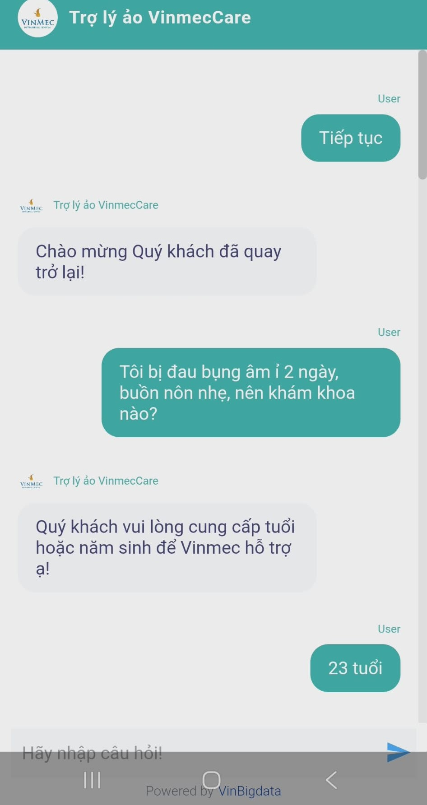
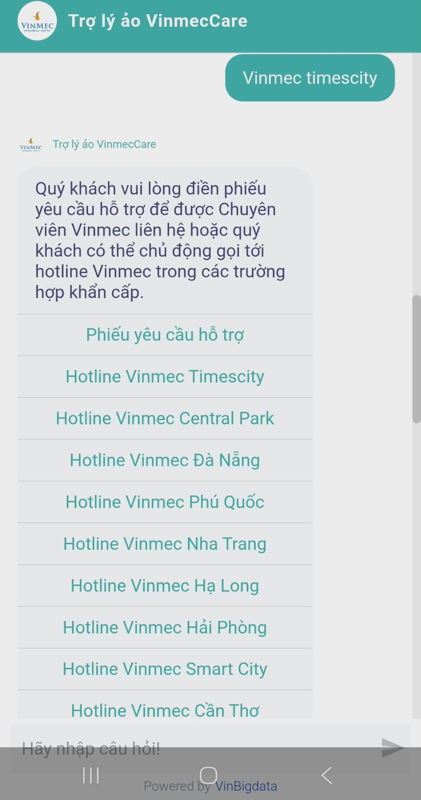
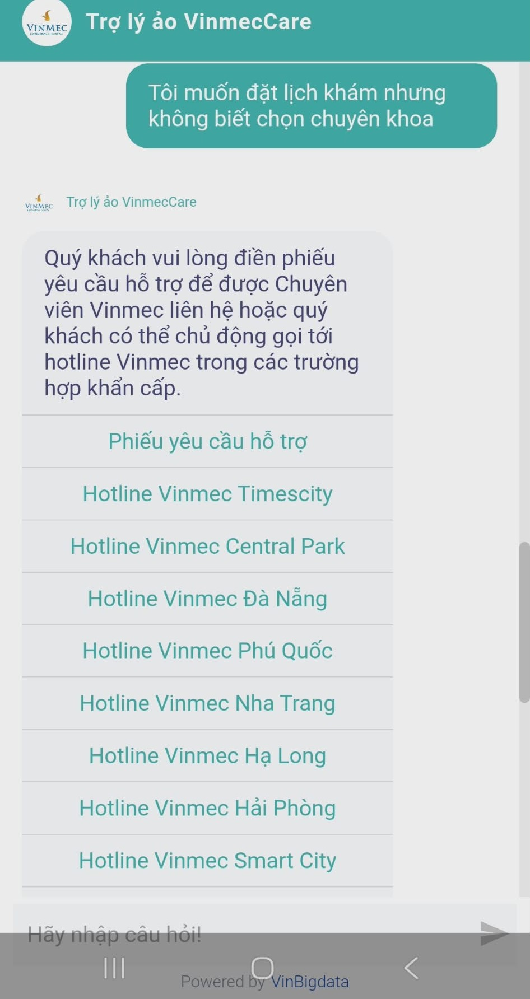
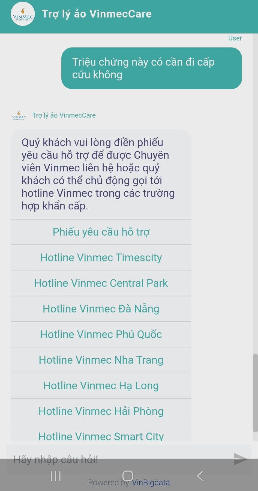
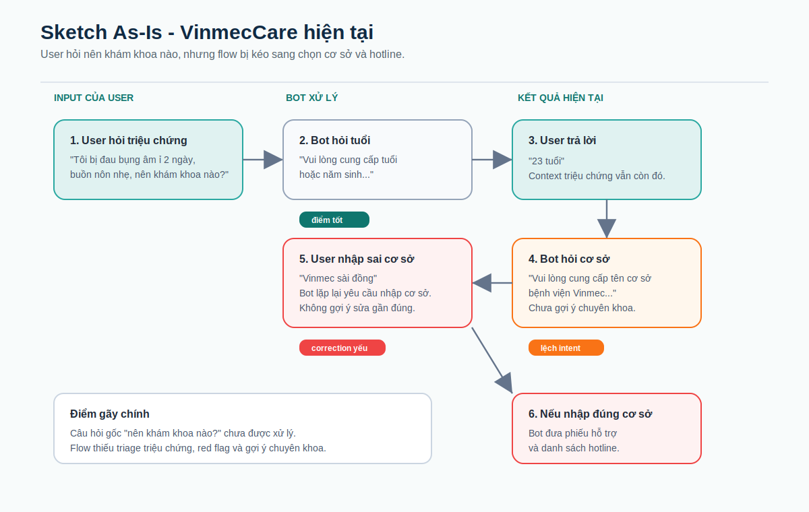
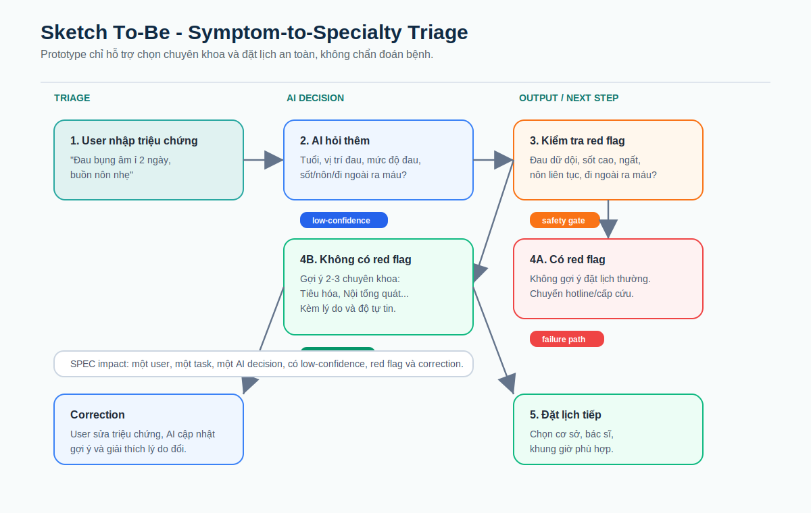

# Workshop Cá Nhân - Track E Healthcare App Teardown

## App / track được chọn

**Track:** E - Healthcare

**Product/app thật:** Vinmec / app hoặc website đặt lịch khám

**AI feature / hướng AI đề xuất:** Gợi ý chuyên khoa phù hợp dựa trên triệu chứng ban đầu, cảnh báo red flag, và hỗ trợ đặt lịch với bác sĩ/chuyên khoa phù hợp.

## 1. Dùng thử: Promise vs Reality

### Promise

Ứng dụng y tế như Vinmec hứa giúp người dùng tìm thông tin bệnh viện, chọn chuyên khoa/bác sĩ, đặt lịch khám nhanh hơn và quản lý lịch khám thuận tiện hơn.

### User được hứa sẽ được giúp

Người dùng lần đầu đi khám hoặc không chắc triệu chứng của mình thuộc chuyên khoa nào. Ví dụ:

- Người bị đau bụng nhưng không biết nên chọn Nội tổng quát, Tiêu hóa hay Cấp cứu.
- Phụ huynh muốn đặt lịch cho con nhưng không chắc nên chọn Nhi, Tai Mũi Họng hay Da liễu.
- Người có triệu chứng mơ hồ, muốn được hướng dẫn bước đầu trước khi đặt lịch.

### Task đã thử / cần quan sát

```text
Tôi bị đau bụng âm ỉ 2 ngày, buồn nôn nhẹ, nên khám khoa nào?
```

```text
Tôi muốn đặt lịch khám nhưng không biết chọn chuyên khoa.
```

```text
Triệu chứng này có cần đi cấp cứu không?
```

### Kỳ vọng

User kỳ vọng hệ thống không bắt họ tự biết tên chuyên khoa ngay từ đầu. Thay vào đó, sản phẩm nên:

- hỏi thêm vài câu phân loại triệu chứng,
- gợi ý 2-3 chuyên khoa phù hợp,
- giải thích ngắn vì sao gợi ý như vậy,
- cảnh báo nếu có dấu hiệu nguy hiểm,
- cho user đặt lịch hoặc chuyển sang kênh hỗ trợ thật.

## 2. Evidence từ screenshot / observation

> Screenshot thật từ flow chat với **Trợ lý ảo VinmecCare**. Nếu lưu ảnh vào folder này, đặt tên gợi ý:
> `vinmec-symptom-age.jpg`, `vinmec-hospital-loop.jpg`, `vinmec-hotline-options.jpg`, `vinmec-no-specialty.jpg`, `vinmec-emergency-question.jpg`.

| Screenshot | Nội dung bằng chứng | Observation liên quan |
|---|---|---|
| `vinmec-symptom-age.jpg` | User hỏi đau bụng/buồn nôn nên khám khoa nào; bot chỉ hỏi tuổi hoặc năm sinh. | Observation 1 |
| `vinmec-hospital-loop.jpg` | Sau khi user nhập 23 tuổi, bot chuyển sang yêu cầu nhập cơ sở Vinmec; khi user nhập "Vinmec sài đồng", bot lặp lại yêu cầu thay vì sửa/gợi ý. | Observation 2 |
| `vinmec-hotline-options.jpg` | Khi user nhập "Vinmec timescity", bot đưa phiếu hỗ trợ/hotline thay vì gợi ý chuyên khoa. | Observation 3 |
| `vinmec-no-specialty.jpg` | Khi user nói không biết chọn chuyên khoa, bot vẫn chuyển sang phiếu hỗ trợ/hotline. | Observation 4 |
| `vinmec-emergency-question.jpg` | Khi user hỏi có cần đi cấp cứu không, bot vẫn trả lời theo fallback hotline chung, không kiểm tra red flag cụ thể. | Observation 5 |

### Observation 1: Bot nhận câu hỏi triệu chứng nhưng chỉ hỏi tuổi



User hỏi:

```text
Tôi bị đau bụng âm ỉ 2 ngày, buồn nôn nhẹ, nên khám khoa nào?
```

VinmecCare trả lời:

```text
Quý khách vui lòng cung cấp tuổi hoặc năm sinh để Vinmec hỗ trợ ạ!
```

User trả lời:

```text
23 tuổi
```

Nhận xét: bot có một bước hỏi lại phù hợp vì tuổi ảnh hưởng đến hướng tư vấn. Đây là tín hiệu tốt của low-confidence path. Tuy nhiên, sau khi có tuổi, bot chưa hỏi tiếp các thông tin quan trọng như vị trí đau, mức độ đau, sốt, nôn nhiều, đi ngoài ra máu hay đau dữ dội.

### Observation 2: Sau khi có tuổi, bot chuyển sang hỏi cơ sở bệnh viện


Sau khi user nhập:

```text
23 tuổi
```

VinmecCare trả lời:

```text
Quý khách vui lòng cung cấp tên cơ sở bệnh viện Vinmec
(ví dụ: Vinmec Timescity, Vinmec Hạ Long, Vinmec Smart City,
Vinmec Central Park, Vinmec Đà Nẵng...)
```

User thử nhập sai:

```text
Vinmec sài đồng
```

Bot vẫn lặp lại yêu cầu cung cấp tên cơ sở bệnh viện Vinmec.

Nhận xét: flow bị chuyển từ **triage triệu chứng** sang **lọc cơ sở bệnh viện** quá sớm. Bot chưa trả lời câu hỏi chính là "nên khám khoa nào". Khi user nhập cơ sở không hợp lệ, bot chỉ lặp lại danh sách ví dụ, chưa có correction tốt như gợi ý cơ sở gần đúng hoặc hỏi user muốn chọn từ danh sách.

### Observation 3: Khi user nhập đúng cơ sở, bot chuyển sang hotline thay vì gợi ý chuyên khoa



User nhập:

```text
Vinmec timescity
```

VinmecCare trả lời:

```text
Quý khách vui lòng điền phiếu yêu cầu hỗ trợ để được Chuyên viên Vinmec liên hệ
hoặc quý khách có thể chủ động gọi tới hotline Vinmec trong các trường hợp khẩn cấp.
```

Bot hiển thị các lựa chọn như:

- Phiếu yêu cầu hỗ trợ
- Hotline Vinmec Timescity
- Hotline Vinmec Central Park
- Hotline Vinmec Đà Nẵng
- Hotline Vinmec Phú Quốc
- Hotline Vinmec Nha Trang

Nhận xét: đây là fallback an toàn ở mức liên hệ người thật/hotline, nhưng chưa đủ tốt cho user đang cần chọn chuyên khoa. Bot không đưa ra 2-3 chuyên khoa phù hợp, không giải thích vì sao, và không phân biệt case bình thường với case cần cấp cứu.

### Observation 4: Bot không hiểu câu hỏi "không biết chọn chuyên khoa"



User hỏi:

```text
Tôi muốn đặt lịch khám nhưng không biết chọn chuyên khoa
```

VinmecCare vẫn trả lời bằng hướng:

```text
Quý khách vui lòng điền phiếu yêu cầu hỗ trợ...
```

Nhận xét: intent chính của user là cần được hỗ trợ ra quyết định chọn chuyên khoa. Bot lại đưa user sang phiếu hỗ trợ/hotline, nên opportunity cho prototype là xây một lớp **symptom-to-specialty triage** trước khi đặt lịch.

### Observation 5: Câu hỏi cấp cứu chưa được xử lý theo triệu chứng cụ thể



User hỏi:

```text
Triệu chứng này có cần đi cấp cứu không
```

VinmecCare vẫn hiển thị cùng một nhóm lựa chọn phiếu hỗ trợ/hotline.

Nhận xét: với healthcare, fallback hotline là cần thiết, nhưng product nên hỏi lại hoặc kiểm tra red flag cụ thể. Ví dụ: đau dữ dội không, sốt cao không, nôn liên tục không, đi ngoài ra máu không, ngất/xỉu không. Nếu có red flag thì mới ưu tiên cấp cứu/hotline; nếu không thì gợi ý chuyên khoa và đặt lịch thường.

## 3. Điểm gãy quan sát được

Điểm gãy chính nằm ở **triage trước khi đặt lịch**:

- Bot có hỏi tuổi, nhưng chưa tiếp tục hỏi triệu chứng đủ sâu để gợi ý chuyên khoa.
- Flow chuyển sang hỏi cơ sở bệnh viện trước khi giải quyết câu hỏi "nên khám khoa nào".
- Khi user nhập cơ sở sai, bot lặp lại yêu cầu thay vì gợi ý sửa.
- Khi user hỏi không biết chọn chuyên khoa, bot chuyển sang phiếu hỗ trợ/hotline.
- Khi user hỏi có cần cấp cứu không, bot chưa kiểm tra red flag cụ thể.

Vấn đề không phải là app thiếu thông tin, mà là thông tin đang được tổ chức theo cấu trúc bệnh viện, trong khi user nghĩ theo triệu chứng và lo lắng của họ.

## 4. Four Paths

| Path | Healthcare app hiện tại / cần cải thiện |
|---|---|
| Happy | User biết rõ cơ sở/chuyên khoa, bot đưa user sang phiếu hỗ trợ hoặc hotline để liên hệ. |
| Low-confidence | Bot hỏi tuổi sau khi user mô tả đau bụng, nhưng cần hỏi tiếp vị trí đau, mức độ, triệu chứng đi kèm và red flag trước khi gợi ý. |
| Failure | User hỏi "nên khám khoa nào" nhưng bot chuyển sang hỏi cơ sở bệnh viện/hotline, làm câu hỏi chính chưa được giải quyết. |
| Correction | Khi user nhập "Vinmec sài đồng", bot lặp lại yêu cầu nhập cơ sở thay vì gợi ý cơ sở hợp lệ gần nhất hoặc cho chọn từ danh sách. |

## 5. Sketch As-Is

### Flow hiện tại

```text
User hỏi:
"Tôi bị đau bụng âm ỉ 2 ngày, buồn nôn nhẹ, nên khám khoa nào?"

-> Bot hỏi tuổi/năm sinh
-> User trả lời: "23 tuổi"
-> Bot hỏi tên cơ sở bệnh viện Vinmec
-> User nhập cơ sở sai hoặc không chắc
-> Bot lặp lại yêu cầu nhập cơ sở
-> Nếu user nhập cơ sở đúng
-> Bot đưa phiếu yêu cầu hỗ trợ và danh sách hotline
```

### User bị kẹt ở đâu?

User bị kẹt tại bước chọn chuyên khoa:

- Không biết triệu chứng thuộc chuyên khoa nào.
- Bot chưa trả lời "nên khám khoa nào".
- Bot hỏi cơ sở bệnh viện trước khi hoàn tất triage.
- Không có câu hỏi kiểm tra red flag.
- Không có gợi ý 2-3 chuyên khoa kèm lý do.
- Khi user nhập sai cơ sở, correction path yếu.

### Path yếu

```text
Low-confidence + safety fallback + correction.
```

Flow hiện tại tốt cho user đã biết mình cần gì, nhưng yếu với user lần đầu, triệu chứng mơ hồ hoặc có rủi ro cần cảnh báo.



## 6. Sketch To-Be

```text
User muốn đặt lịch khám nhưng chưa biết chọn chuyên khoa

-> User nhập triệu chứng ngắn: 
   "Tôi bị đau bụng âm ỉ 2 ngày, buồn nôn nhẹ"

-> AI hỏi thêm 3 câu:
   1. Đau ở vùng nào?
   2. Mức độ đau từ 1-10?
   3. Có sốt, nôn nhiều, đi ngoài ra máu, đau dữ dội không?

-> Nếu không có red flag:
   AI gợi ý 2-3 chuyên khoa phù hợp
   Ví dụ: Tiêu hóa, Nội tổng quát
   Kèm lý do ngắn và mức độ tự tin

-> User chọn chuyên khoa
-> App hiển thị bác sĩ/lịch trống phù hợp
-> User đặt lịch

-> Nếu có red flag:
   AI không gợi ý đặt lịch thường
   Hiển thị cảnh báo đi cấp cứu/gọi hotline/gặp nhân viên y tế

-> Nếu user sửa triệu chứng:
   AI cập nhật gợi ý chuyên khoa
   Hiển thị lý do vì sao đổi gợi ý
```



## 7. Product Decision

### Trigger

User muốn đặt lịch khám nhưng chỉ biết mô tả triệu chứng, không biết nên chọn chuyên khoa nào.

Ví dụ:

```text
Tôi bị đau bụng âm ỉ 2 ngày, buồn nôn nhẹ, nên khám khoa nào?
```

### Product làm chưa tốt điều gì?

Flow đặt lịch yêu cầu user chọn chuyên khoa quá sớm. Điều này phù hợp với user đã biết rõ nhu cầu, nhưng không phù hợp với user có triệu chứng mơ hồ.

### Vấn đề product

User đang cần **decision support** trước khi đặt lịch, không chỉ cần danh sách chuyên khoa/bác sĩ.

Điều còn thiếu:

- bước hỏi thêm triệu chứng,
- gợi ý chuyên khoa có giải thích,
- mức độ tự tin của AI,
- red flag path cho trường hợp nguy hiểm,
- correction path khi user sửa thông tin.

### Hậu quả

User có thể chọn sai chuyên khoa, đặt nhầm lịch, mất thời gian, hoặc bỏ qua dấu hiệu cần xử lý khẩn cấp.

### Quyết định sửa

```text
Lỗi thuộc layer: Intent + Safety + UX Recovery.
```

Prototype nên sửa bằng cách:

- thêm symptom intake trước bước chọn chuyên khoa,
- AI chỉ gợi ý chuyên khoa, không chẩn đoán bệnh,
- hiển thị 2-3 lựa chọn thay vì một câu trả lời chắc chắn,
- đưa red flag vào failure path,
- cho user sửa triệu chứng và cập nhật gợi ý.

## 8. Câu chốt đưa vào SPEC

```text
Finding này sẽ đổi SPEC theo hướng:
prototype không build một chatbot healthcare chung chung,
mà build một flow hỗ trợ user lần đầu chọn chuyên khoa trước khi đặt lịch.
AI sẽ hỏi thêm vài câu, gợi ý 2-3 chuyên khoa kèm lý do,
và chuyển sang cảnh báo/hotline khi có red flag.
```

## 9. Evidence -> Build Slice

### Evidence

User không chỉ hỏi thông tin bệnh viện. Trong screenshot, user hỏi trực tiếp:

```text
Tôi bị đau bụng âm ỉ 2 ngày, buồn nôn nhẹ, nên khám khoa nào?
```

Bot có hỏi tuổi, nhưng sau đó chuyển sang hỏi cơ sở bệnh viện và hotline. Khi user hỏi:

```text
Tôi muốn đặt lịch khám nhưng không biết chọn chuyên khoa
```

bot vẫn đưa sang phiếu yêu cầu hỗ trợ/hotline, chưa giúp user chọn chuyên khoa.

### Insight

User mới đi khám không thiếu danh sách bệnh viện hay hotline. Họ thiếu **hướng dẫn ra quyết định trước khi đặt lịch**.

Vấn đề sâu hơn là user nghĩ theo triệu chứng và mức độ lo lắng, còn product hiện tại phản hồi theo cấu trúc vận hành của bệnh viện: cơ sở, hotline, phiếu hỗ trợ.

### Opportunity

AI có thể giúp bằng cách hỏi 3 câu ngắn để phân loại triệu chứng, sau đó gợi ý 2-3 chuyên khoa phù hợp kèm lý do. Với case có dấu hiệu nguy hiểm, AI không gợi ý đặt lịch thường mà chuyển sang hotline/cấp cứu hoặc người thật.

### Build slice

```text
Cho người mới khám không biết chọn chuyên khoa,
đang mô tả triệu chứng đau bụng/buồn nôn trước khi đặt lịch,
prototype dùng AI để hỏi 3 câu triage và gợi ý 2-3 chuyên khoa phù hợp,
tạo ra lựa chọn chuyên khoa + lý do + next step đặt lịch,
và xử lý red flag bằng cách chuyển hotline/cấp cứu/người thật.
```

### Không build

```text
Không build "AI assistant cho healthcare" chung chung.
Không build chatbot chẩn đoán bệnh.
Không build toàn bộ hệ thống đặt lịch bệnh viện.
```
