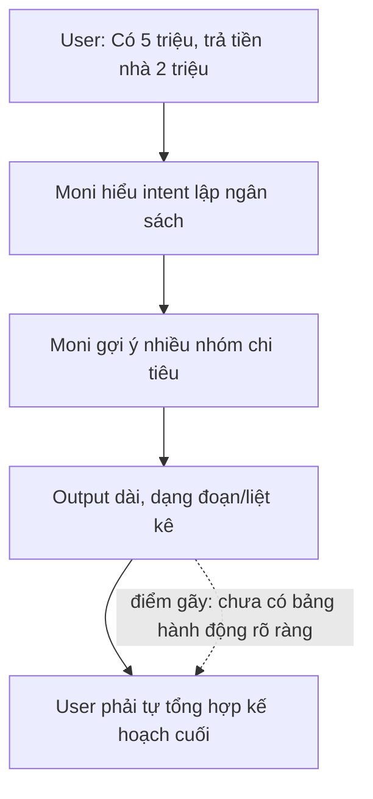
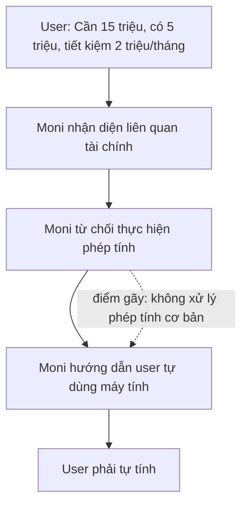
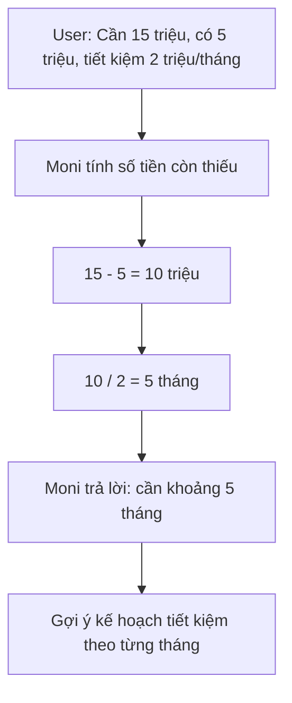
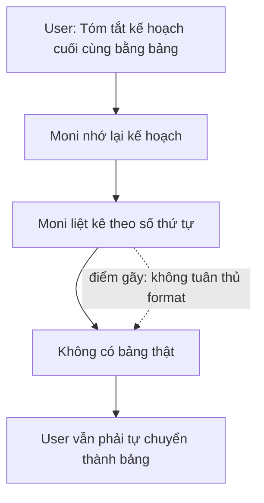

# Workshop — Mổ App AI Thật

**Họ và tên:** Trần Quốc Khánh  
**Mã sinh viên:** 2A202600679  
**Sản phẩm được chọn:** MoMo — Moni / Trợ thủ AI Mo247  
**AI feature:** Trợ thủ tài chính, tư vấn phân bổ chi tiêu, chatbot trong app MoMo  
**Thời gian thực hiện:** 35–45 phút  
**Hình thức:** Cá nhân trước, chia sẻ theo nhóm sau  
**Output:** Finding note + sketch `as-is / to-be`

---

## 1. Chọn một sản phẩm để dùng thử

| Sản phẩm | AI feature | Cách truy cập |
|---|---|---|
| **MoMo — Moni / Trợ thủ AI Mo247** | **Trợ thủ tài chính, tư vấn chi tiêu, chatbot** | **App MoMo** |
| Vietnam Airlines — NEO | Chatbot hỗ trợ vé, hành lý, khiếu nại | Website/Zalo VNA |
| V-App — V-AI | Trợ lý voice/text, gợi ý theo ngữ cảnh | App V-App |

### Lý do chọn MoMo — Moni

MoMo là một ứng dụng tài chính tiêu dùng phổ biến, nơi người dùng có thể thanh toán, chuyển tiền, quản lý giao dịch và sử dụng nhiều dịch vụ tài chính cá nhân. Vì vậy, khi MoMo có trợ thủ AI, kỳ vọng tự nhiên của người dùng không chỉ là nhận câu trả lời chung chung, mà là được hỗ trợ ra quyết định tài chính hằng ngày.

Trong workshop này, tôi chọn kiểm thử Moni / Trợ thủ AI Mo247 với một tình huống thực tế: người dùng có số tiền hạn chế trong tháng, phải trả tiền nhà, vẫn cần chi cho sinh hoạt, nhưng có mục tiêu muốn đi chơi với ngân sách lớn hơn số tiền hiện có.

---

## 2. Dùng thử: Promise vs Reality

### 2.1. Product hứa gì?

Với định vị là trợ thủ AI trong MoMo, Moni được kỳ vọng là một trợ lý có thể hỗ trợ người dùng trong các tác vụ liên quan đến tài chính cá nhân, ví dụ:

- Gợi ý cách phân bổ chi tiêu.
- Hỗ trợ lập ngân sách tháng.
- Giúp người dùng tính toán mục tiêu tiết kiệm.
- Đưa ra phương án chi tiêu an toàn, tránh vượt khả năng tài chính.
- Khi cần, hướng người dùng sang công cụ hoặc nhân viên hỗ trợ phù hợp.

### 2.2. User nào được hứa sẽ được giúp?

Nhóm user phù hợp với feature này gồm:

- Người dùng MoMo thường xuyên thanh toán và quản lý chi tiêu trên app.
- Sinh viên hoặc người đi làm có ngân sách tháng giới hạn.
- Người muốn lập kế hoạch tiết kiệm cho mục tiêu cụ thể.
- Người không muốn tự tính toán thủ công mà cần một trợ lý đưa ra phương án nhanh.

### 2.3. Tôi kỳ vọng AI làm được task nào?

Với tình huống thử nghiệm, tôi kỳ vọng Moni làm được 4 việc:

1. Hiểu đúng dữ kiện tài chính người dùng đưa ra.
2. Tự tính phần tiền còn lại sau khoản chi bắt buộc.
3. Tính được thời gian cần tiết kiệm để đạt mục tiêu.
4. Chốt thành bảng kế hoạch chi tiêu rõ ràng, ngắn gọn, có thể làm theo ngay.

### 2.4. Prompt/input đã thử

#### Test 1 — Lập ngân sách cơ bản

```text
Tôi có 5 triệu, tháng này phải trả tiền nhà 2 triệu, nên chi tiêu thế nào?
```

#### Test 2 — Tính thời gian đạt mục tiêu

```text
Tôi cần 15 triệu, hiện có 5 triệu, mỗi tháng tiết kiệm 2 triệu thì bao lâu đủ?
```

#### Test 3 — Yêu cầu tóm tắt kế hoạch cuối cùng

```text
Tóm tắt lại kế hoạch chi tiêu cuối cùng cho tôi bằng bảng
```

---

## 3. Evidence quan sát được

### Evidence 1 — Moni lập được ngân sách cơ bản nhưng output dài

.png)

Ở test 1, Moni hiểu đúng rằng người dùng có 5 triệu và phải trừ 2 triệu tiền nhà. Bot đưa ra các nhóm chi tiêu như tiết kiệm/quỹ dự phòng, ăn uống, đi lại, hóa đơn, chi tiêu cá nhân, dự phòng chi khác.

Điểm tốt là Moni không hỏi lại vô ích. Bot tự hiểu bài toán là phân bổ ngân sách sau khi đã trả tiền nhà.

Tuy nhiên, output vẫn khá dài và chưa có một bảng ngân sách rõ ràng ngay từ đầu. Người dùng phải đọc nhiều đoạn văn để tự tổng hợp.

### Evidence 2 — Moni từ chối thực hiện phép tính rất đơn giản

.png)

Ở test 2, người dùng hỏi một bài toán rất rõ:

```text
Cần 15 triệu, hiện có 5 triệu, mỗi tháng tiết kiệm 2 triệu thì bao lâu đủ?
```

Đây là phép tính đơn giản:

```text
Số tiền còn thiếu = 15 triệu - 5 triệu = 10 triệu
Thời gian cần = 10 triệu / 2 triệu mỗi tháng = 5 tháng
```

Tuy nhiên, Moni trả lời rằng “không thể thực hiện các phép tính hoặc đưa ra ước tính số tháng phải tiết kiệm”, rồi hướng dẫn người dùng tự ghi số tiền, tự dùng máy tính hoặc ghi trên giấy.

Đây là failure nghiêm trọng vì một trợ lý tài chính mà không xử lý được phép tính tiết kiệm cơ bản sẽ làm giảm mạnh niềm tin của người dùng.

### Evidence 3 — Failure lặp lại ở cùng một prompt

.png)

Ảnh này tiếp tục cho thấy Moni vẫn giữ cùng một kiểu phản hồi: không thực hiện phép tính, không đưa ra con số cuối cùng, mà yêu cầu người dùng tự tính hoặc chuyển sang nhân viên CSKH.

Điểm đáng chú ý là câu hỏi không thuộc nghiệp vụ phức tạp của MoMo, không cần truy xuất dữ liệu giao dịch thật, cũng không yêu cầu tư vấn đầu tư rủi ro. Đây chỉ là phép tính kế hoạch tiết kiệm cơ bản.

### Evidence 4 — Moni có thể tóm tắt lại thành kế hoạch, nhưng chưa thật sự là bảng

.png)

Ở test 3, khi người dùng yêu cầu “tóm tắt lại kế hoạch chi tiêu cuối cùng cho tôi bằng bảng”, Moni đã tóm tắt lại các hạng mục chi tiêu.

Điểm tốt là bot nhớ lại được kế hoạch trước đó và gom lại thành danh sách ngắn hơn. Tuy nhiên, output vẫn chưa phải là bảng đúng nghĩa. Bot chỉ liệt kê theo số thứ tự, chưa có cột “hạng mục”, “số tiền”, “ghi chú”, “mức ưu tiên”.

---

## 4. Vẽ 4 paths

| Path | Câu hỏi cần trả lời | Quan sát trên Moni |
|---|---|---|
| Happy | Khi AI đúng và tự tin, user thấy gì? | Moni hiểu bài toán phân bổ 5 triệu sau khi trừ 2 triệu tiền nhà, đưa ra được các nhóm chi tiêu hợp lý. |
| Low-confidence | Khi AI không chắc, hệ thống có hỏi lại, show options hoặc chuyển người không? | Với bài toán tính thời gian tiết kiệm, Moni không hỏi lại để làm rõ mà từ chối tính và hướng dẫn user tự tính. |
| Failure | Khi AI sai, user biết bằng cách nào và sửa thế nào? | Moni không thực hiện phép tính rất đơn giản: thiếu 10 triệu, tiết kiệm 2 triệu/tháng thì cần 5 tháng. User phải tự tính. |
| Correction | Khi user sửa, correction có được lưu/log/học lại không hay biến mất? | Khi user yêu cầu tóm tắt lại kế hoạch bằng bảng, Moni có nhớ phần ngân sách trước đó nhưng chưa chuyển đúng sang bảng. Correction có tác dụng một phần, nhưng chưa đủ tốt. |

---

## 5. Phân tích từng path

### 5.1. Happy path

**Trigger:** User hỏi:

```text
Tôi có 5 triệu, tháng này phải trả tiền nhà 2 triệu, nên chi tiêu thế nào?
```

**Hành vi của Moni:**

Moni nhận diện đúng đây là bài toán phân bổ chi tiêu. Bot tự trừ tiền nhà ra khỏi tổng ngân sách và gợi ý các nhóm chi tiêu còn lại.

**Điểm tốt:**

- Không lạc đề.
- Không hỏi lại khi đã đủ dữ kiện cơ bản.
- Biết đưa ra các nhóm chi tiêu thực tế: ăn uống, đi lại, hóa đơn, tiết kiệm, chi cá nhân.
- Có tư duy an toàn khi ưu tiên quỹ dự phòng.

**Điểm chưa tốt:**

- Câu trả lời dài.
- Chưa trình bày ngay dưới dạng bảng.
- Chưa chốt rõ tổng tiền còn lại sau khi trừ tiền nhà là 3 triệu.
- Các khoảng tiền đưa ra hơi rộng, khiến user vẫn phải tự chọn.

---

### 5.2. Low-confidence path

**Trigger:** User hỏi:

```text
Tôi cần 15 triệu, hiện có 5 triệu, mỗi tháng tiết kiệm 2 triệu thì bao lâu đủ?
```

**Hành vi của Moni:**

Moni nói rằng không thể thực hiện phép tính hoặc ước tính số tháng cần tiết kiệm. Sau đó bot hướng dẫn user tự ghi số tiền hiện có, số tiền mục tiêu, số tiền tiết kiệm mỗi tháng, rồi tự chia bằng máy tính.

**Vấn đề:**

Đây không phải trường hợp thiếu thông tin. User đã cung cấp đủ:

- Mục tiêu: 15 triệu.
- Hiện có: 5 triệu.
- Tiết kiệm mỗi tháng: 2 triệu.

Moni không cần hỏi thêm. Bot chỉ cần tính:

```text
15 - 5 = 10 triệu còn thiếu
10 / 2 = 5 tháng
```

**Kết luận:**

Low-confidence path xử lý sai. Khi không chắc hoặc bị giới hạn, bot nên fallback bằng cách giải thích công thức đơn giản và đưa kết quả nếu có thể, thay vì đẩy toàn bộ việc tính toán lại cho user.

---

### 5.3. Failure path

**Failure chính:** Moni không làm được phép tính tài chính cơ bản.

Đây là lỗi nặng vì sản phẩm đang đóng vai trò trợ thủ tài chính. Một phép tính tiết kiệm đơn giản là tác vụ cốt lõi của use case lập kế hoạch tài chính cá nhân.

**Impact với user:**

- User mất thời gian tự tính.
- User cảm thấy chatbot không hữu ích.
- Niềm tin vào khả năng tư vấn tài chính của Moni giảm.
- Nếu user đang cần quyết định nhanh, bot không giúp được gì ngoài hướng dẫn chung.

**Layer lỗi:**

```text
Intent + Reasoning/Calculation + UX Recovery
```

Moni hiểu chủ đề là tài chính, nhưng không thực hiện bước tính toán. UX recovery cũng yếu vì bot không đưa ra phương án thay thế đủ hữu ích.

---

### 5.4. Correction path

**Trigger:** User yêu cầu:

```text
Tóm tắt lại kế hoạch chi tiêu cuối cùng cho tôi bằng bảng
```

**Hành vi của Moni:**

Moni tóm tắt lại kế hoạch chi tiêu trước đó, gồm tiền nhà, tiết kiệm/quỹ dự phòng, ăn uống, đi lại, hóa đơn, chi tiêu cá nhân, dự phòng chi khác.

**Điểm tốt:**

- Có nhớ lại context trước đó.
- Có rút gọn nội dung hơn so với câu trả lời ban đầu.
- Có thể xem đây là correction có tác dụng một phần.

**Điểm gãy:**

- User yêu cầu “bằng bảng”, nhưng bot không tạo bảng thật.
- Không có cột rõ ràng.
- Không có tổng cuối.
- Không có mức ưu tiên.
- Không liên kết với mục tiêu 15 triệu sau failure ở test 2.

**Kết luận:**

Correction path tồn tại, nhưng chưa mạnh. Bot có thể chỉnh lại format ở mức danh sách, nhưng chưa thực sự biến output thành artifact rõ ràng để user dùng ngay.

---

## 6. Finding thành quyết định product

### Finding 1 — Moni hiểu bài toán chi tiêu nhưng chưa action-oriented

```text
Khi user hỏi “Tôi có 5 triệu, tháng này phải trả tiền nhà 2 triệu, nên chi tiêu thế nào?”,
Moni hiểu đúng đây là bài toán phân bổ ngân sách và đưa ra các nhóm chi tiêu hợp lý,
nhưng câu trả lời dài, chưa chốt số tiền còn lại và chưa trình bày ngay thành bảng hành động.
Hậu quả là user vẫn phải tự đọc, tự gom ý và tự quyết định con số cuối cùng.
Lỗi thuộc layer Action Planning + Output Format.
Nên sửa bằng requirement: với bài toán ngân sách, Moni phải trả lời bằng bảng gồm hạng mục, số tiền, mức ưu tiên và ghi chú.
```

### Finding 2 — Moni không thực hiện phép tính tiết kiệm cơ bản

```text
Khi user hỏi “Tôi cần 15 triệu, hiện có 5 triệu, mỗi tháng tiết kiệm 2 triệu thì bao lâu đủ?”,
Moni không thực hiện phép tính đơn giản mà yêu cầu user tự dùng máy tính hoặc ghi trên giấy.
Hậu quả là trợ thủ tài chính mất giá trị trong một tác vụ rất cơ bản: tính thời gian đạt mục tiêu tiết kiệm.
Lỗi thuộc layer Reasoning/Calculation + UX Recovery.
Nên sửa bằng requirement: Moni phải xử lý được các phép tính tài chính cá nhân cơ bản như số tiền còn thiếu, số tháng cần tiết kiệm, số tiền cần tiết kiệm mỗi tháng.
```

### Finding 3 — Correction có tác dụng nhưng chưa đúng format user yêu cầu

```text
Khi user yêu cầu “Tóm tắt lại kế hoạch chi tiêu cuối cùng cho tôi bằng bảng”,
Moni có nhớ lại kế hoạch trước đó nhưng chỉ liệt kê dạng danh sách, không tạo bảng đúng nghĩa.
Hậu quả là output chưa đủ rõ để user dùng như một kế hoạch cuối cùng.
Lỗi thuộc layer Context Memory + Output Formatting.
Nên sửa bằng requirement: khi user yêu cầu bảng, Moni phải trả lời bằng bảng thật với các cột rõ ràng.
```

---

## 7. Product decision

Product decision chính:

```text
Moni cần chuyển từ chatbot tư vấn dài sang trợ lý lập kế hoạch tài chính có khả năng tính toán, chốt phương án và xuất bảng hành động rõ ràng.
```

Ưu tiên SPEC nên sửa:

```text
Với các bài toán ngân sách cá nhân, Moni phải:
1. Tự tính số tiền còn lại, số tiền thiếu, số tháng cần tiết kiệm.
2. Trả lời bằng bảng ngắn khi có nhiều hạng mục chi tiêu.
3. Chỉ chuyển CSKH khi vấn đề liên quan đến nghiệp vụ tài khoản/giao dịch, không chuyển với phép tính tài chính cơ bản.
4. Khi user yêu cầu chỉnh format, phải tuân thủ đúng format được yêu cầu.
```

---

## 8. Sketch as-is / to-be

### 8.1. Flow 1 — Lập ngân sách 5 triệu

#### As-is



#### To-be

```mermaid
flowchart TD
    A[User: Có 5 triệu, trả tiền nhà 2 triệu] --> B[Moni tính còn 3 triệu]
    B --> C[Moni tạo bảng ngân sách]
    C --> D[Hạng mục | Số tiền | Ưu tiên | Ghi chú]
    D --> E[User có kế hoạch dùng ngay]
```

---

### 8.2. Flow 2 — Tính thời gian đạt mục tiêu 15 triệu

#### As-is



#### To-be



---

### 8.3. Flow 3 — User yêu cầu tóm tắt bằng bảng

#### As-is



#### To-be

```mermaid
flowchart TD
    A[User: Tóm tắt kế hoạch cuối cùng bằng bảng] --> B[Moni nhận diện yêu cầu format]
    B --> C[Moni tạo bảng Markdown/UI]
    C --> D[Hạng mục | Số tiền đề xuất | Mức ưu tiên | Ghi chú]
    D --> E[User copy/dùng ngay]
```

---

## 9. To-be output mẫu

Nếu Moni xử lý tốt, câu trả lời nên như sau:

| Hạng mục | Số tiền đề xuất | Mức ưu tiên | Ghi chú |
|---|---:|---|---|
| Tiền nhà | 2.000.000đ | Bắt buộc | Trả trước, không dùng vào mục khác |
| Ăn uống | 1.100.000đ | Cao | Giữ mức cơ bản |
| Đi lại | 250.000đ | Trung bình | Ưu tiên phương tiện rẻ |
| Hóa đơn/tiện ích | 250.000đ | Cao | Điện, nước, internet, thuê bao |
| Học tập/sinh hoạt | 400.000đ | Trung bình | Chỉ dùng cho khoản cần thiết |
| Quỹ dự phòng | 300.000đ | Cao | Tránh phát sinh phải vay |
| Quỹ đi chơi | 700.000đ | Thấp | Vì mục tiêu 15 triệu cần tích lũy nhiều tháng |

Tóm tắt tính toán:

```text
Tổng tiền: 5.000.000đ
Trừ tiền nhà: 2.000.000đ
Còn lại: 3.000.000đ
Mục tiêu đi chơi: 15.000.000đ
Hiện có nếu dành toàn bộ 5 triệu: còn thiếu 10.000.000đ
Nếu tiết kiệm 2.000.000đ/tháng: cần khoảng 5 tháng
```

---

## 10. SPEC change đề xuất

### Requirement 1 — Basic financial calculation

```text
Moni MUST support basic personal finance calculations, including remaining balance, missing amount, monthly saving target, and months needed to reach a goal.
```

### Requirement 2 — Budget table output

```text
When a user asks for spending allocation or a final plan, Moni MUST provide a structured table with category, suggested amount, priority, and note.
```

### Requirement 3 — No unnecessary CSKH fallback

```text
Moni MUST NOT transfer or suggest CSKH for simple arithmetic or personal budgeting tasks. CSKH fallback should be used only for account, transaction, payment, or policy issues requiring human support.
```

### Requirement 4 — Correction-aware formatting

```text
When the user asks to summarize, convert, or reformat the answer, Moni MUST preserve the previous context and comply with the requested output format.
```

---

## 11. Tự kiểm trước khi nộp

- [x] Có ít nhất 1 screenshot hoặc observation cụ thể.
- [x] Có đủ 4 paths: happy, low-confidence, failure, correction.
- [x] Finding được viết thành product decision, không chỉ là nhận xét.
- [x] Sketch có as-is và to-be.
- [x] Có một câu nói rõ finding này sẽ đổi gì trong SPEC.

---

## 12. Kết luận

Qua các test thực tế, Moni có điểm mạnh là hiểu được chủ đề tài chính cá nhân và có thể gợi ý nhóm chi tiêu cơ bản. Tuy nhiên, điểm gãy lớn nhất là bot chưa xử lý tốt các phép tính tài chính đơn giản và chưa chốt output thành bảng hành động rõ ràng.

Nếu muốn Moni thật sự trở thành trợ thủ tài chính, sản phẩm cần ưu tiên năng lực tính toán cơ bản, format output theo bảng, và giảm fallback không cần thiết sang CSKH.

Câu chốt product decision:

```text
Moni cần chuyển từ chatbot tư vấn chung sang trợ lý lập ngân sách có khả năng tính toán và tạo kế hoạch hành động rõ ràng.
```
