# Evidence Pack — Vinmec Smart Intake & Telehealth Router

Nộp kèm Thin SPEC cuối Day 05.

## 1. Nhóm và track

**Tên nhóm:** VinM

**Track:** Healthcare / Telehealth / Patient Intake

**Product/app đã chọn:** Trợ lý ảo VinmecCare và luồng hỏi đáp sức khỏe/đặt lịch khám từ xa.

**Build slice đang nghĩ:**  
AI Smart Intake Assistant: trợ lý tiếp nhận triệu chứng ban đầu, hỏi thêm thông tin còn thiếu, phát hiện dấu hiệu nguy hiểm, gợi ý chuyên khoa/luồng khám từ xa phù hợp và tạo bản tóm tắt triệu chứng nháp cho bác sĩ.

---

## 2. Self-use evidence

Nhóm tự dùng Trợ lý ảo VinmecCare và một chatbot sức khỏe tham khảo để quan sát điểm gãy trong workflow.

| Observation | Screenshot/link | Path liên quan | Điều học được |
|---|---|---|---|
| Khi user nhập câu rất mơ hồ/không thực tế như “sốt 90 độ”, VinmecCare trả lời rằng hệ tri thức chưa có câu trả lời. | 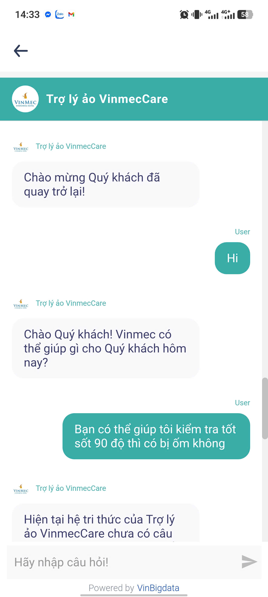 | Failure / Low-confidence | Bot có fallback, nhưng fallback chưa hướng dẫn user sửa câu hỏi, chưa hỏi lại dữ kiện tối thiểu, chưa giúp user recover. |
| Khi user mô tả triệu chứng khá rõ như “đau dạ dày, đầy hơi, khó tiêu 2 tuần nay”, VinmecCare chỉ hỏi tuổi/năm sinh. | 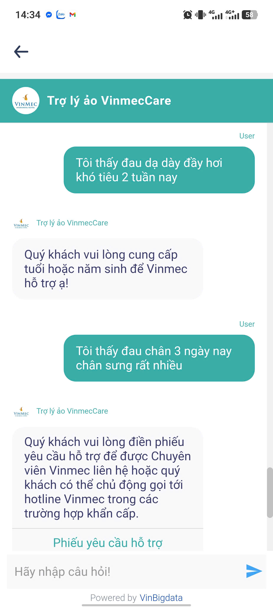 | Happy / Low-confidence | Bot bắt đầu intake bằng tuổi là hợp lý, nhưng chưa khai thác tiếp các slot quan trọng như mức độ đau, vị trí, triệu chứng đi kèm, red flag. |
| Với triệu chứng “đau chân 3 ngày nay, chân sưng rất nhiều”, VinmecCare chuyển sang phiếu yêu cầu hỗ trợ/hotline. |  | Failure / Handoff | Có handoff, nhưng chưa giải thích rõ vì sao cần handoff, chưa tóm tắt thông tin cho chuyên viên/bác sĩ. |
| Khi user hỏi “Đau bụng thì phải làm sao” hoặc “Đau bụng âm ỉ nhiều ngày rồi hãy tư vấn cho tôi”, VinmecCare tiếp tục yêu cầu tuổi/năm sinh giống nhau. | 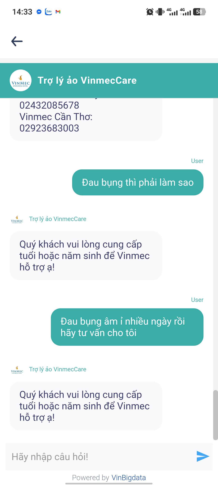 | Low-confidence | Bot đang dùng form cứng theo tuổi, chưa thể hiện khả năng hỏi động theo triệu chứng và mức độ thiếu thông tin. |
| Với câu “Tôi đang bị sốt 40 độ”, VinmecCare đưa hướng dẫn tự chăm sóc như uống thuốc hạ sốt, bù nước, nghỉ ngơi. | 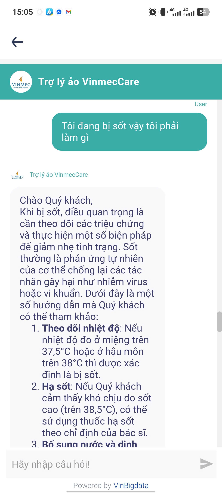 | Failure | Sốt 40°C là tình huống cần được xử lý thận trọng. Bot nên ưu tiên red flag/handoff hoặc hỏi nhanh dấu hiệu nguy hiểm thay vì đưa lời khuyên chăm sóc chung. |
| Với câu “Tôi đang bị sốt vậy tôi phải làm gì”, VinmecCare trả lời khá dài, mang tính thông tin chung. | 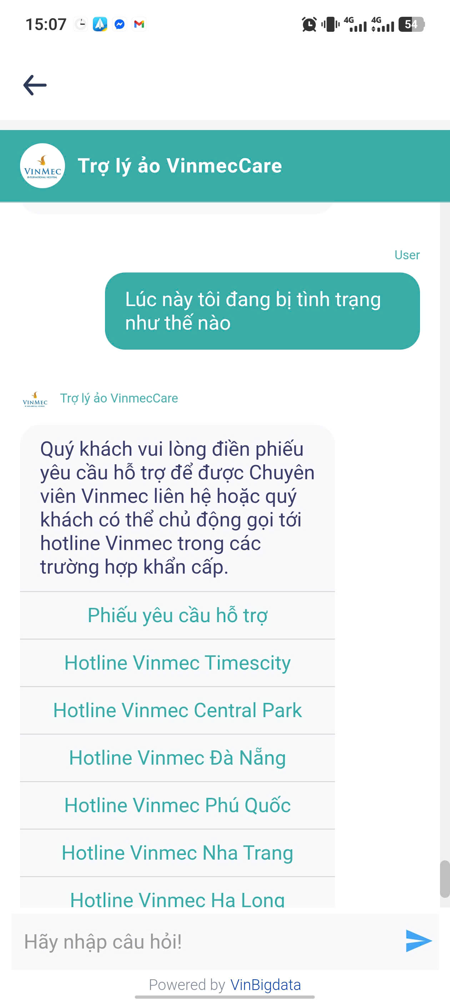 | Low-confidence | Khi thông tin còn thiếu nhiệt độ, tuổi, thời gian sốt, triệu chứng đi kèm, bot nên hỏi thêm trước khi tư vấn. |
| Với câu “Lúc này tôi đang bị tình trạng như thế nào”, VinmecCare chuyển sang phiếu hỗ trợ và hotline. | 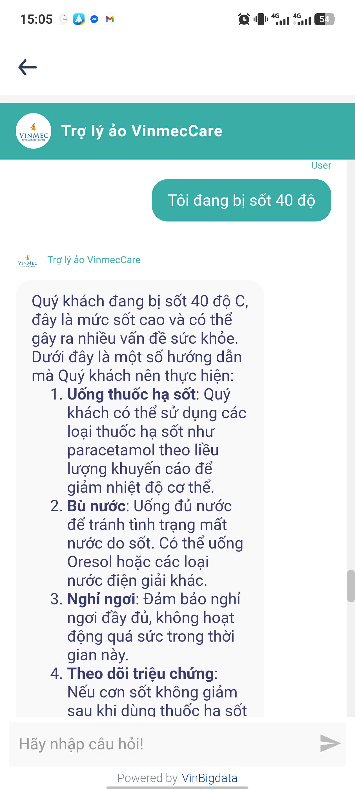 | Low-confidence / Handoff | Handoff có tồn tại, nhưng thiếu cơ chế summary để nhân viên/bác sĩ biết user đã nói gì trước đó. |
| Với câu “Tôi bị chảy máu tôi phải làm sao”, VinmecCare đưa hướng dẫn xử lý tại nhà trước khi làm rõ loại chảy máu/mức độ. | 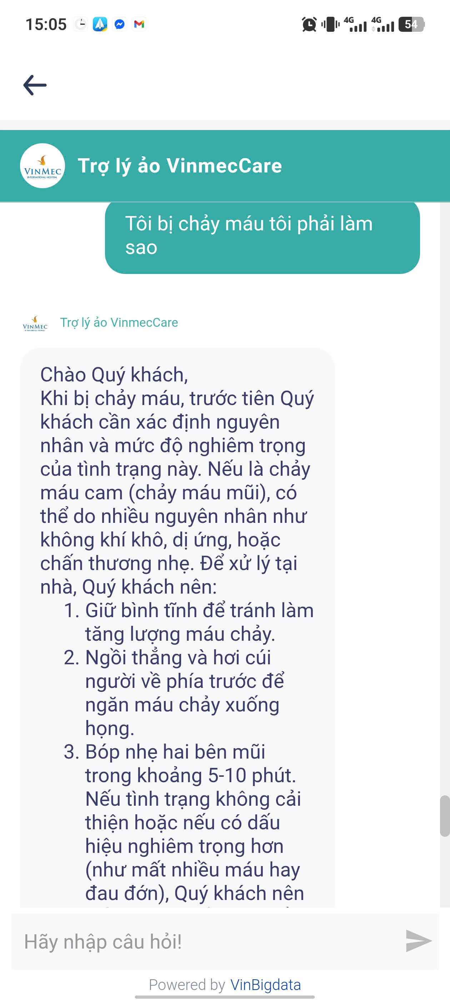 | Failure | “Chảy máu” là nhóm triệu chứng cần hỏi rõ vị trí, lượng máu, nguyên nhân, tình trạng toàn thân. Bot cần red flag check trước khi tư vấn. |

---

## 3. User / review / social evidence

Nguồn ngoài nhóm cần bổ sung bằng review App Store/Google Play, comment, phỏng vấn nhanh hoặc nguồn public. Hiện nhóm đã có self-use evidence; phần ngoài nhóm sẽ được bổ sung trước checkpoint M1 Day 06.

| Quote / review / observation | Nguồn | User là ai? | Pain/failure mode |
|---|---|---|---|
| Người dùng khi đặt khám online thường không chắc nên chọn chuyên khoa nào nếu chỉ biết triệu chứng chung như đau bụng, sốt, chóng mặt. | Phỏng vấn nhanh 1-2 người từng đặt lịch khám online, sẽ bổ sung | Bệnh nhân lần đầu đặt khám | Không biết chọn chuyên khoa, dễ chọn sai luồng khám hoặc bỏ cuộc. |
| Người bệnh đang mệt không muốn gõ mô tả dài; họ cần câu hỏi ngắn, dễ bấm chọn. | Phỏng vấn nhanh/user observation, sẽ bổ sung | Bệnh nhân/người nhà bệnh nhân | Bot hỏi cứng hoặc trả lời dài làm user khó tiếp tục. |
| Bác sĩ/nhân viên hỗ trợ cần thông tin có cấu trúc thay vì đọc toàn bộ chat log. | Giả định cần kiểm bằng phỏng vấn/analog từ form tiền khám | Bác sĩ/nhân viên tiếp nhận | Nếu không có summary, bác sĩ vẫn phải hỏi lại từ đầu. |

Nếu chưa kịp có nguồn ngoài nhóm:

```text
Đây là giả định ban đầu. Nhóm sẽ kiểm bằng cách phỏng vấn nhanh 2 người từng đặt lịch khám online và chụp lại ít nhất 2 evidence từ review/app public trước checkpoint M1 Day 06.
```

---

## 4. Competitor / analog evidence

| App / mô hình tham khảo | Họ xử lý task này thế nào? | Pattern học được | Có áp dụng trong 1 ngày không? |
|---|---|---|---|
| Chatbot sức khỏe tham khảo có reasoning/citation | Khi user mô tả “đau dạ dày, đầy hơi, khó tiêu 2 tuần”, chatbot phân tích nguyên nhân phổ biến, nêu khi nào cần đi khám và có disclaimer không chẩn đoán. | Trả lời y tế cần có disclaimer, cảnh báo red flag, và khuyến nghị đi khám khi kéo dài. | Có, nhưng chỉ áp dụng pattern an toàn; không build chatbot chẩn đoán. |
| Chatbot sức khỏe tham khảo | Khi user hỏi muốn gặp bác sĩ, chatbot gợi ý chuyên khoa Nội Tiêu hóa và bệnh viện phù hợp. | AI có thể hỗ trợ routing sang chuyên khoa, nhưng phải tránh gợi ý quá rộng hoặc quá tự tin. | Có. Prototype chỉ gợi ý 1-2 chuyên khoa mức tham khảo. |
| Form tiền khám / pre-consultation form | Thu thập thông tin theo các trường cố định trước buổi khám. | Chat tự nhiên nên được chuyển thành slot có cấu trúc: tuổi, thời gian, mức độ, triệu chứng đi kèm, red flag. | Có. Build được bằng slot-filling đơn giản. |
| Chatbot CSKH dùng quick replies | Dẫn user trả lời nhanh bằng nút bấm thay vì gõ dài. | Quick replies giảm công gõ và giúp dữ liệu vào sạch hơn. | Có. Prototype dùng quick replies cho 2-3 câu hỏi intake. |

Ảnh minh chứng analog:

- 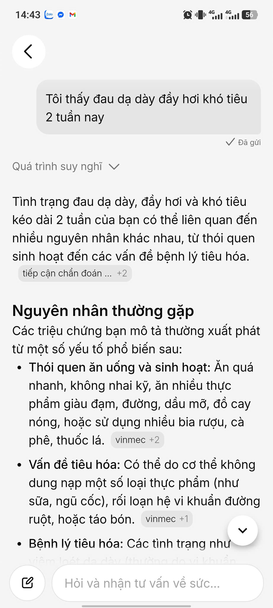
- 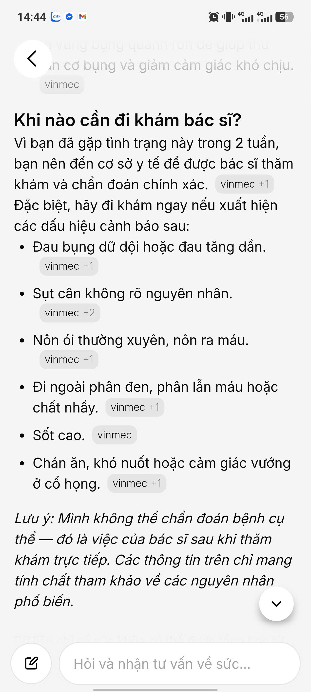
- 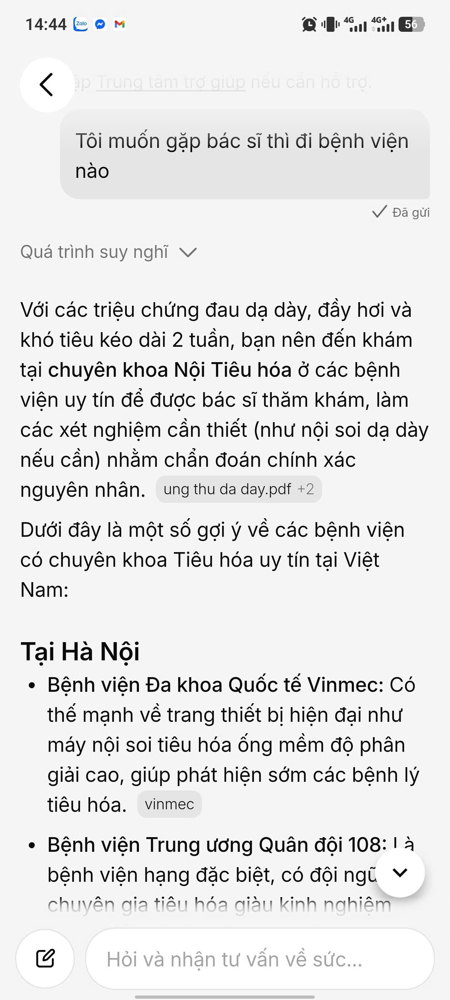
- 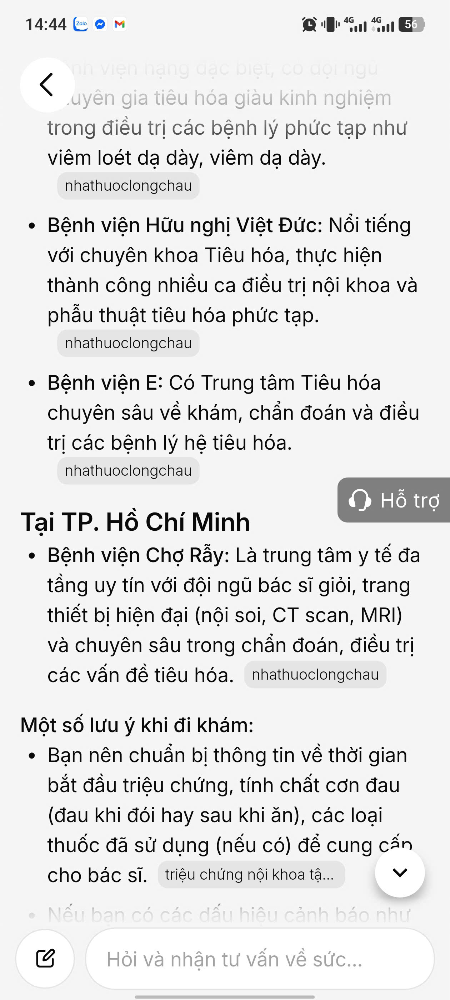

---

## 5. Evidence -> Insight

```text
Evidence nổi bật nhất:
VinmecCare có thể hỏi tuổi/năm sinh, fallback hoặc chuyển hotline, nhưng chưa thể hiện rõ một flow intake thông minh: hỏi đúng thông tin còn thiếu theo triệu chứng, phát hiện red flag trước khi tư vấn, cho user sửa ngữ cảnh, và tạo bản tóm tắt có cấu trúc cho bác sĩ.

Insight:
User không chỉ cần một chatbot trả lời câu hỏi y tế.
Thật ra họ cần một trợ lý tiếp nhận an toàn, biết biến mô tả triệu chứng mơ hồ thành thông tin có cấu trúc, biết dừng khi có dấu hiệu nguy hiểm, và biết chuyển thông tin sạch sang người thật.

Opportunity:
AI có thể giúp bằng cách augment bước tiếp nhận trước khám: kiểm tra slot còn thiếu, hỏi thêm bằng câu hỏi ngắn kèm quick replies, phát hiện red flag, gợi ý chuyên khoa ở mức tham khảo, và tạo draft summary cho bác sĩ.
```

---

## 6. Evidence đổi SPEC như thế nào?

- [x] Đổi user chính.
- [x] Đổi pain statement.
- [x] Đổi build slice.
- [x] Đổi Auto/Aug decision.
- [x] Đổi 4 paths.
- [x] Đổi failure mode.
- [x] Đổi owner/test plan.

Ghi rõ 1-2 thay đổi quan trọng:

```text
Trước evidence, nhóm định làm chatbot y tế hỏi đáp chung cho Vinmec.

Sau evidence, nhóm đổi thành AI Smart Intake Assistant cho bước tiếp nhận trước khám từ xa.

Lý do:
Chatbot y tế tổng quát quá rộng, rủi ro cao và khó demo trong 1 ngày. Evidence cho thấy pain rõ hơn nằm ở bước user mô tả triệu chứng thiếu dữ kiện, bot hỏi chưa đủ linh hoạt, có case red flag cần xử lý an toàn, và khi handoff vẫn thiếu bản tóm tắt cho người thật.
```
